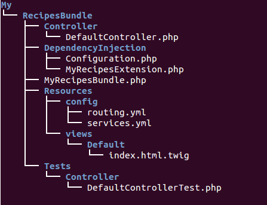

# Bundles

En Symfony2, un bundle es un conjunto de archivos y directorios cuyo objetivo es proporcionar funcionalidad al sistema. Entre estos archivos podemos encontrar modelos, entidades, archivos de configuración, javascripts y hojas de estilo.

## Generación automática de bundles

El primer paso necesario para extender la funcionalidad de nuestra instalación Symfony será crear un bundle personalizado. Aunque podemos crearlo manualmente, la consola dispone de un práctico comando para ello.

```
$ php app/console generate:bundle --namespace=My/RecipesBundle --format=yml
```

En el comando estamos pasando dos parámetros. El primero definirá el espacio de nombres en el que se alojarán las clases y funciones del bundle. El parámetro format especifica el formato de los archivos de configuración. Además de `yml` podemos elegir `xml` y `php`.

Cuando lo ejecutemos iniciaremos un diálogo via terminal donde se nos permitirán una serie de personalizaciones. De momento elegiremos las opciones por defecto. Al finalizar, se nos mostrará un texto similar al siguiente:

`You can now start using the generated code!`

El comando habrá realizado las siguientes acciones:
- Crear un nuevo directorio `src/My/RecipesBundle` que contendrá algunas clases autogeneradas.

- Actualizar `app/config/routing.yml` añadiendo las rutas del bundle al sistema de enrutado.
```
my_recipes:
    resource: "@MyRecipesBundle/Resources/config/routing.yml"
    prefix:   /
```

- Activar el nuevo bundle en `app/AppKernel.php`
```
$bundles = array(
    //...
    new My\RecipesBundle\MyRecipesBundle(),
);
```


## Organización de los bundles
Un bundle autogenerado por la consola presenta la siguiente estructura:




* `MyRecipesBundle.php` define el bundle extendiendo la clase `Bundle` de Symfony 2. Esta es la clase que se instancia en AppKernel al registar el bundle en la instalación Symfony2. En ella podemos personalizar algunos parámetros como el espacio de nombres o la extensión a utilizar en el contenedor de inyección de dependencias, que veremos más adelante.
* `DependencyInjection` configurar el bundle en más detalle en el contenedor de inyección y realizar algunas operaciones previas al compilado del mismo.
* `Controller` aloja a los controladores de la aplicación.
* `Resources` almacena información de enrutado, servicios proporcionados por el bundle y plantillas. También puede contener archivos de traducción, documentación o archivos estáticos css y js.
* `Tests` contendrá los tests automáticos que escribamos para el bundle.


