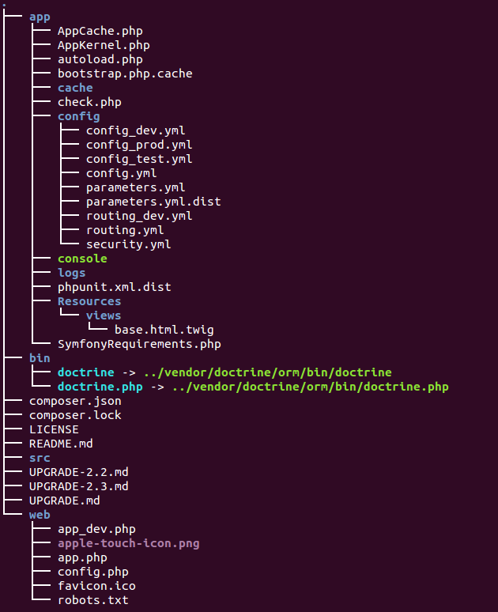

# Organización de directorios

Una instalación de Symfony tiene una estructura similar a la siguiente:

En `/app` se encuentran los archivos correspondientes a la aplicación:

* `AppKernel.php` define qué _bundles_ hay instalados en nuestra instalación. Cada vez que queramos instalar un nuevo bundle deberemos incluirlo en el método `registerBundles()` de esta clase.
* `config` almacena los distintos archivos de configuración de la aplicación. Esto incluye los **parámetros** de la aplicación según entorno, los **servicios** incluídos y los **enrutadores** y **firewalls** instalados.
* `cache` es el directorio por defecto en el que Symfony almacena algunos datos para optimizar el rendimiento de la caché.
* `logs` contiene los registros de actividad para cada entorno.
* `console` es un binario que contiene la consola de Symfony, útil para realizar algunas operaciones. La veremos en próximos capítulos.
* `Resources` almacena recursos de distinta índole, ya sean **plantillas**, **fixtures** o librerías de diversa índole.

En `/bin` se almacenan ejecutables destinados a ser invocados desde terminal.

`/src` contiene nuestros propios bundles. Es decir, los componentes (controladores, rutas, entidades, modelos, vistas...) escritos por nosotros.

Por último, en `/web` se deposita la parte pública de la aplicación web. Hojas de estilo, Javascripts y elementos estáticos como imágenes o vídeos.

Casi todos los elementos de esta estructura de directorios pueden configurarse, tal y como se explica en la [documentación oficial](http://symfony.com/doc/current/cookbook/configuration/override_dir_structure.html).