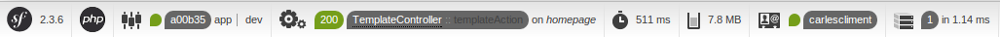
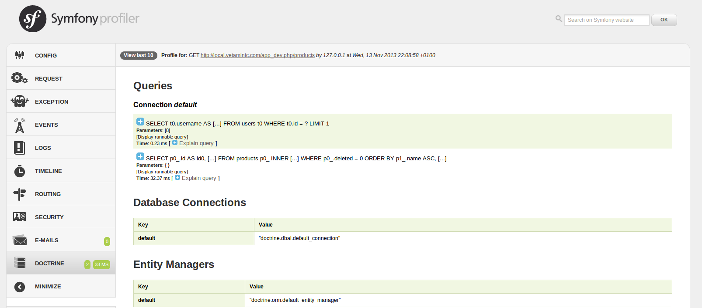

# El profiler y la consola

La instalación Symfony proporciona dos útiles herramientas que todo desarrollador utiliza tarde o temprano. El profiler servirá para proporcionar diversa información sobre lo que ocurre en cualquier petición. La consola, además de para extraer alguna información, permitirá realizar acciones desde el terminal, facilitando la automatización de procesos.

## Profiler

El profiler es un componente de Symfony que recoge información de cada petición que recibe la aplicación y la almacena para su análisis posterior. En la edición estándar de Symfony2, el profiler y las herramientas incorporadas Web Debug Toolbar y Web Profiler están activadas para el entorno de desarrollo.

Podemos (des)activar y personalizar el profiler a través del archivo de configuración `config.yml`.


```config.yml
web_profiler:
    toolbar:              true
    position:             bottom

    # gives you the opportunity to look at the collected data before following the redirect
    intercept_redirects:  false
```

Una vez activado en un entorno, ante cualquier petición se nos mostrará una útil barra de herramientas con información diversa.



Los distintos iconos se expandirán tras seleccionarlos y mostrarán información más detallada. A continuación se muestra el detalle de consultas realizadas a la base de datos en una petición.




### El profiler en tests funcionales

El profiler de Symfony puede utilizarse para automatizar pruebas de rendimiento. Por ejemplo, se podría implementar una batería de tests que recorriese una aplicación y se asegurase de que no se sobrepasa un número de consultas determinado. Para obtener más información sobre cómo implementar estas pruebas, consultad la receta [How to use the Profiler in a Functional Test](http://symfony.com/doc/current/cookbook/testing/profiling.html) en la documentación oficial.


### El profiler y el rendimiento

La activación del profiler genera un impacto profundo en el rendimiento de la aplicación. La recolección de los datos, procesamiento y posterior almacenamiento en ficheros temporales hacen del profiler una herramienta peligrosa en entornos de producción. Lo mejor, por ello, es activarlo únicamente en el entorno de desarrollo.

Del mismo modo, conviene desactivar el profiler en todos los tests funcionales en los que no sea estrictamente necesario, permitiendo baterías de tests más rápidas que agilicen los procesos de integración.


## Consola

La consola de Symfony 2 proporciona una interfaz de terminal para operar con nuestra aplicación Symfony. Para comprobar los comandos disponibles debemos ejecutar `app/console` sin parámetros. El número de comandos disponibles variará en función de los bundles que hayamos instalados, puesto que estos pueden registrar acciones en la consola.

Los comandos de la sección `generate` permiten automatizar la creación de bundles, controladores o entidades de doctrine. Es el llamado `scaffolding` o andamiaje.

Otros comandos imprescindibles de la consola son aquellos que permiten gestionar la caché:

`app/console cache:clear` eliminará los archivos de caché.
`app/console cache:warmup` efectuará el calentamiento de una caché vacía, mejorando el rendimiento de la web antes de que lleguen peticiones.


Casi todos los comandos permiten especificar el entorno en el que van a ser utilizados con el parámetro -e. El siguiente comando se ejecutará únicamente en el entorno de test:

`app/console doctrine:schema:create -e test`

En una instalación estándar de Symfony 2 hay demasiados comandos para ser tratados aquí individualmente. La mejor referencia de cada uno de ellos se encuentra en la propia interfaz de ayuda de la consola. Para una información más extensa y actualizada [consulta la documentación oficial](http://symfony.com/doc/current/components/console/introduction.html).