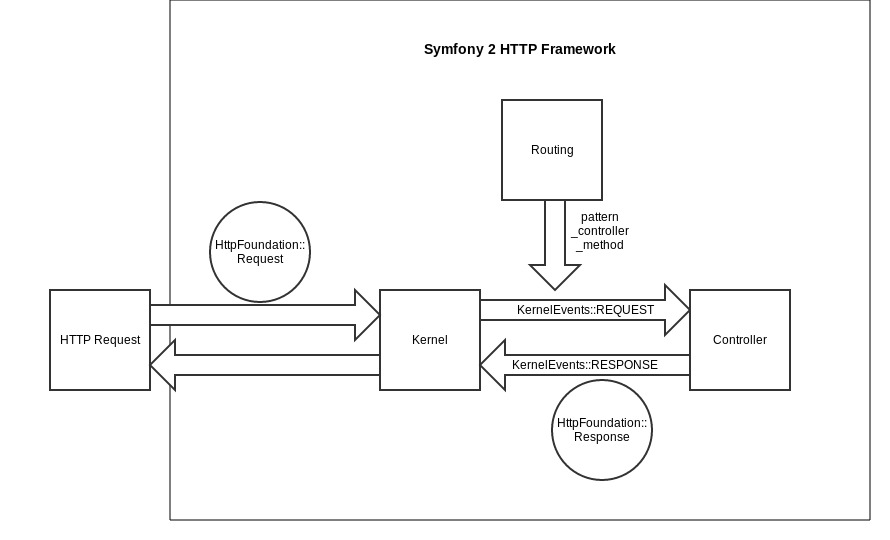

# ¿Qué es Symfony?

## Qué es Symfony

De acuerdo a la [definición de Symfony en su propia web](http://symfony.com/what-is-symfony), Symfony es *un framework PHP, una filosofía y una comunidad*. En su artículo [What is Symfony2?](http://fabien.potencier.org/article/49/what-is-symfony2), Fabien Potencier se extiende un poco más en la definición de Symfony. Según Fabien, leemos que, por una parte...

`
Symfony2 is a reusable set of standalone, decoupled, and cohesive PHP components that solve common web development problems.
`

... y por otra ...

`
Based on these components, Symfony2 is also a full-stack web framework.
`

Es decir, hay varias maneras de utilizar Symfony en los proyectos PHP. La más obvia consiste en construir nuestra aplicacion sobre el framework Symfony 2 al completo, pero si lo deseamos también podemos utilizar únicamente algunos de sus componentes.

## HTTP Framework
A menudo, Symfony 2 es definido como un *framework MVC*. El [patrón MVC](es.wikipedia.org/wiki/Modelo_Vista_Controlador) consiste en separar en capas distintas los componentes encargados de manejar la vista, el modelo y el controlador.

Aunque Symfony 2 comparte algunos de los conceptos del patrón MVC (separación por capas), su objetivo es otro; atender peticiones HTTP de una manera organizada y eficaz. Por ello, Symfony 2 se define como un *framework HTTP*.

Symfony abstrae la petición HTTP en un objeto Request que es procesado por el framework. Para ello intervienen varios componentes; el enrutado, el controlador responsable de dicha petición y el Event Dispatcher. La forma en que esté organizado el modelo depende completamente de nosotros. Podemos devolver contenido HTML o respuestas en JSON, XML, o cualquier otro formato. Por lo tanto, ni el modelo ni la vista dependen en absoluto del framework.

Las ventajas de esta arquitectura son innumerables. Al abstraer la petición PHP en un objeto response, el framework ya no depende de las históricas variables PHP como `$_SESSION`, `$_SERVER`, `$_POST` o `$_GET`. Esto permite crear peticiones programáticamente y pasárselas al kernel sin necesidad de emplear peticiones *reales*. De esta manera es posible utilizar aplicaciones Symfony desde distintos entornos, como programas externos o tests automáticos.

Por otra parte y gracias a su sistema de eventos, el framework Symfony permite a los desarrolladores intervenir en cualquier punto de la petición para transformar los datos o realizar operaciones en paralelo.

## Comunidad
Ninguna plataforma open-source sería nada sin su comunidad. Las comunidades de software libre son lugares excelentes donde aprender de los demás, recibir y aportar nuevos puntos de vista y, en definitiva, pasar un buen rato.

Además de los eventos internacionales, en España se celebra anualmente la conferencia [deSymfony](http://desymfony.com/) donde se citan los mejores desarrolladores del framework. También se han organizado otros grupos a nivel local, entre los que tenemos el grupo local de Valencia, [SymfonyVLC](http://www.symfony-valencia.es/).

