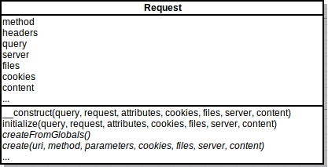
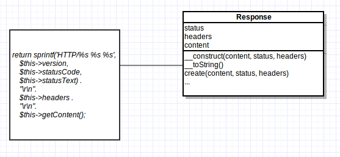

# Request y Response

En el anteriores capítulos hemos visto algunos fundamentos de HTTP y definido Symfony como un **framework HTTP**. Symfony construye una capa de abstracción sobre HTTP, que se sustenta en dos clases importantes del componente HTTPFoundation: Request y Response.

## La clase Request



La clase Request contiene todo lo necesario para realizar una petición web, incluídas las cookies que permitirán gestionar las sesiones, archivos transferidos, etcétera. Podríamos crear una request utilizando las viariables globales PHP:

```php
$request = Request::createFromGlobals();
```
Así es como se procesa una petición en `web/app.php`:

```
$kernel = new AppKernel('prod');
$request = Request::createFromGlobals();
$response = $kernel->handle($request);
```

Pero también es posible crear una petición programáticamente sin necesidad de realizar una request real, pasarla a nuestra aplicación Symfony y procesar la respuesta:

```php
$kernel = new AppKernel('prod');
$request = Request::create('/recetas/pollo-al-pil-pil', 'GET');
$response = $kernel->handle($request);
```


## La clase Response



Response encapsula una respuesta HTTP. Toda petición a `AppKernel` debe devolver un objeto response. Como se observa en `web/app.php`, una vez recuperado el objeto Response se invoca al método `send()` encargado de mostrar la respuesta:


```
$response = $kernel->handle($request);
$response->send();
```

## Tipos especiales de respuesta

Un caso específico de respuesta es la clase [JsonResponse](http://api.symfony.com/2.2/Symfony/Component/HttpFoundation/JsonResponse.html) para respuestas cuyo contenido se devuelve en [JSON](http://en.wikipedia.org/wiki/JSON).

Otro ejemplo lo tenemos en la clase [RedirectResponse](http://api.symfony.com/master/Symfony/Component/HttpFoundation/RedirectResponse.html) que indica a los clientes la dirección a la que deben dirigirse.

La clase [StreamedResponse](http://api.symfony.com/master/Symfony/Component/HttpFoundation/StreamedResponse.html) ofrece respuestas en streaming y es utilizada fundamentalmente en medios pesados como vídeo o grandes volúmenes de datos.


## Eventos en el ciclo de una petición

A lo largo del ciclo de vida de una petición, Symfony dispara distintos eventos que permiten a sus componentes reaccionar para modificar la respuesta o realizar acciones diversas. Cualquier bundle de nuestra aplicación puede asímismo adherirse a estos eventos.

Antes de procesar la petición, en el método `handle()` de la clase `HttpKernel`, se dispara un evento `KernelEvents::REQUEST`:


```
$event = new GetResponseEvent($this, $request, $type);
$this->dispatcher->dispatch(KernelEvents::REQUEST, $event);
```

Para obtener el controlador que atenderá la petición se utiliza un evento `KernelEvents::CONTROLLER`. El componente de routing recibe este evento, examina el objeto Request y la configuración de enrutado y devuelve el controlador correspondiente.

```
$event = new FilterControllerEvent($this, $controller, $request, $type);
$this->dispatcher->dispatch(KernelEvents::CONTROLLER, $event);
$controller = $event->getController();
```

En algunas ocasiones el controlador no devuelve una instancia de `Response`. Por ejemplo, la etiqueta [Template()](http://symfony.com/doc/current/bundles/SensioFrameworkExtraBundle/annotations/view.html) permite aligerar las acciones de un controlador devolviendo un array y siguiendo cierto convenio. En estos casos, `AppKernel` dispara un evento `KernelEvents::VIEW`, y serán otros componentes los que se encarguen de construir el objeto `Response`.


Cualquier excepción que ocurra durante el procesamiento de una petición tendrá como consecuencia que se dispare un evento `KernelEvents::EXCEPTION`. Symfony utiliza este evento para enmascarar la excepción en una vista más amigable y ofrecer herramientas de debugging.


Una vez enviada la respuesta, en `web/app.php` se dispara un evento `KernelEvents::TERMINATE`.

```
$kernel->terminate($request, $response);
```


