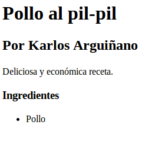
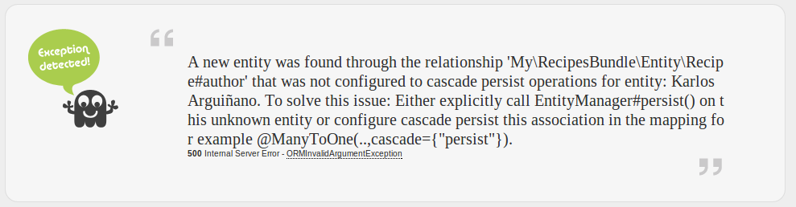

# Relaciones

Los ORMs se basan en sistemas relacionales de bases de datos, por lo que facilitan la definición de relaciones entre las distintas entidades de nuestra aplicación.

## Definir relaciones

Siguiendo con el ejemplo de recetas, podemos suponer que la entidad `Recipe` se relaciona con la entidad `Author` definida en la siguiente clase.

```Author.php
// src/My/RecipesBundle/Entity/Author.php
namespace My\RecipesBundle\Entity;


class Author
{
    private $id;

    protected $name;

    protected $surname;
}
```

```Author.orm.yml
# src/My/RecipesBundle/Resources/config/doctrine/Author.orm.yml
My\RecipesBundle\Entity\Author:
    type: entity
    table: authors
    id:
        id:
            type: integer
            generator: { strategy: AUTO }
    fields:
        name:
            type: string
            length: 255

        surname:
            type: string
            length: 255
```

Para añadir esta nueva entidad en la base de datos ejecutaríamos el siguiente comando de consola:

```
$ php app/console doctrine:schema:update --force
Updating database schema...
Database schema updated successfully! "1" queries were executed
```

En este punto tendríamos dos entidades, `Recipe` y `Author`, mapeadas en sendas tablas `recipes` y `authors`. ¿Como podemos establecer relaciones entre ellas?


## Muchos a uno

Para crear una relación muchos a uno desde `Recipe` a `Author` añadiremos, en primer lugar, un atributo `$author` en la entidad `Recipe`.

```
// src/My/RecipesBundle/Entity/Recipe.php

class Recipe
{
    // ...
    protected $author;

}
```

Y completaremos el archivo yaml de Doctrine.

```Recipe.orm.yml
# src/My/RecipesBundle/Resources/config/doctrine/Recipe.orm.yml
My\RecipesBundle\Entity\Recipe:
    type: entity
    table: recipes
    manyToOne:
        author:
            targetEntity: Author
            joinColumn:
                name: author_id
                referencedColumnName: id
    # ...
```

La sentencias a ejecutar por Doctrine son las siguientes:

```
$ php app/console doctrine:schema:update --dump-sql
ALTER TABLE recipes ADD author_id INT DEFAULT NULL;
ALTER TABLE recipes ADD CONSTRAINT FK_A369E2B5F675F31B FOREIGN KEY (author_id) REFERENCES authors (id);
CREATE INDEX IDX_A369E2B5F675F31B ON recipes (author_id)
```

Actualizaremos la base de datos como hemos visto anteriormente.


## Muchos a muchos


```Ingredient.php
// src/My/RecipesBundle/Entity/Ingredient.php
namespace My\RecipesBundle\Entity;


class Ingredient
{
    private $id;

    protected $name;
}
```

```Ingredient.orm.yml
# src/My/RecipesBundle/Resources/config/doctrine/Ingredient.orm.yml
My\RecipesBundle\Entity\Ingredient:
    type: entity
    table: ingredients
    id:
        id:
            type: integer
            generator: { strategy: AUTO }
    fields:
        name:
            type: string
            length: 255
```


Para crear una relación muchos a muchos desde `Recipe` a `Ingredient` añadiremos, en primer lugar, un atributo `$ingredients` en la entidad.

```
// src/My/RecipesBundle/Entity/Recipe.php
use Doctrine\Common\Collections\ArrayCollection;

class Recipe
{
    // ...
    protected $ingredients;

    public function __construct()
    {
        $this->ingredients = new ArrayCollection();
    }
}
```

Y completaremos el archivo yaml de Doctrine.

```Recipe.orm.yml
# src/My/RecipesBundle/Resources/config/doctrine/Recipe.orm.yml
My\RecipesBundle\Entity\Recipe:
    type: entity
    table: recipes
    manyToMany:
        ingredients:
            targetEntity: Ingredient
            joinTable:
                name: recipe_ingredients
                joinColumns:
                    recipe_id:
                        referencedColumnName: id
                inverseJoinColumns:
                    ingredient_id:
                        referencedColumnName: id
    # ...
```

Si ejecutamos un dump podremos ver que la relación muchos a muchos se realiza mediante una tercera tabla, definida por `joinTable`:

```
$ php app/console doctrine:schema:update --dump-sql
CREATE TABLE recipe_ingredients (recipe_id INT NOT NULL, ingredient_id INT NOT NULL, INDEX IDX_9F925F2B59D8A214 (recipe_id), INDEX IDX_9F925F2B933FE08C (ingredient_id), PRIMARY KEY(recipe_id, ingredient_id)) DEFAULT CHARACTER SET utf8 COLLATE utf8_unicode_ci ENGINE = InnoDB;
ALTER TABLE recipe_ingredients ADD CONSTRAINT FK_9F925F2B59D8A214 FOREIGN KEY (recipe_id) REFERENCES recipes (id);
ALTER TABLE recipe_ingredients ADD CONSTRAINT FK_9F925F2B933FE08C FOREIGN KEY (ingredient_id) REFERENCES ingredients (id)
```


## Manipular relaciones

Ya tenemos una entidad `Recipe` bastante compleja, por lo que vamos a facilitar su configuración con un constructor más amplio. Además, añadiremos un método que permita añadir ingredientes.

```
class Recipe
{
    // ...

    public function __construct(Author $author, $name, $description, $difficulty)
    {
        $this->author = $author;
        $this->name = $name;
        $this->description = $description;
        $this->difficulty = $difficulty;
        $this->ingredients = new ArrayCollection();
    }

    public function add(Ingredient $ingredient)
    {
        $this->ingredients[] = $ingredient;
    }
}
```

También añadiremos constructores al resto de entidades.

```
class Author
{
    // ...

    public function __construct($name, $surname)
    {
        $this->name = $name;
        $this->surname = $surname;
    }

}
```

```
class Ingredient
{
    // ...

    public function __construct($name)
    {
        $this->name = $name;
    }

}
```


Podemos crear una completa receta con el siguiente controlador:

```
    public function createAction()
    {
        $em = $this->getDoctrine()->getEntityManager();

        $author = new Author('Karlos', 'Arguiñano');
        $em->persist($author);

        $ingredient = new Ingredient('Pollo');
        $em->persist($ingredient);

        $recipe = new Recipe($author, 'Pollo al pil-pil', 'Deliciosa y económica receta.', 'fácil');
        $em->persist($recipe);

        $recipe->add($ingredient);

        $em->flush();

        return $this->redirect($this->generateUrl('my_recipes_show', array('id' => $recipe->getId())));
    }
```

Con un par de rutas, una sencilla plantilla y unos pocos métodos obtenemos el siguiente resultado:




## Operaciones en cascada

Aunque hemos conseguido construir una receta con autor e ingredientes, el código de `createAction()` no parece muy elegante. El mayor problema está en que debemos persistir las entidades hoja (`$author`, `$ingredient`) antes de persistir la entidad padre (`$recipe`). Esto es así porque, a priori, Doctrine no sabe qué hacer con las entidades relacionadas que no han sido persistidas. Si eliminásemos los persist de `$author` e `$ingredient` obtendríamos el siguiente resultado.



El mensaje nos sugiere dos soluciones; volver a la solución anterior de invocar explícitamente el método persist o configurar la asociación con la operación en casacada. Optaremos por la segunda opción, modificando el archivo de mapeo de la entida `Recipe`:

```
My\RecipesBundle\Entity\Recipe:
    type: entity
    table: recipes
    manyToOne:
        author:
            # ...
            cascade: ["persist"]
    manyToMany:
        ingredients:
            # ...
            cascade: ["persist"]
    # ...
```

De este modo podremos limpiar el controlador de esos incómodos `persist()`.

```
    public function createAction()
    {
        $author = new Author('Karlos', 'Arguiñano');
        $ingredient = new Ingredient('Pollo');
        $recipe = new Recipe($author, 'Pollo al pil-pil', 'Deliciosa y económica receta.', 'fácil');
        $recipe->add($ingredient);

        $this->persistAndFlush($recipe);

        return $this->redirect($this->generateUrl('my_recipes_show', array('id' => $recipe->getId())));
    }

    private function persistAndFlush(Recipe $recipe)
    {
        $em = $this->getDoctrine()->getEntityManager();
        $em->persist($recipe);
        $em->flush();
    }
```

Doctrine facilita cuatro operaciones en cascada:
- *persist*: Guardar entidades asociadas.
- *remove*: Eliminar entidades asociadas.
- *merge*: Combina entidades asociadas.
- *detach*: Desvincula las entidades de sus equivalentes en la base de datos.

La opción `all` configura todas ellas a la vez.

Es importante destacar que estas operaciones se efectúan a nivel lógico, en memoria, y no en la base de datos. Para configurar el borrado en cascada a nivel de base de datos deberemos añadir la cláusula correspondiente en el mapeado de la entidad.

```
My\RecipesBundle\Entity\Recipe:
    # ...
    manyToOne:
        author:
            joinColumn:
                onDelete: "CASCADE"
                # ...
```

```
$ php app/console doctrine:schema:update --dump-sql
ALTER TABLE recipes DROP FOREIGN KEY FK_A369E2B5F675F31B;
ALTER TABLE recipes ADD CONSTRAINT FK_A369E2B5F675F31B FOREIGN KEY (author_id) REFERENCES authors (id) ON DELETE CASCADE
```


## Relaciones unidireccionales y bidireccionales


## Lazy y greedy

