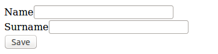

# Conceptos básicos

Es difícil imaginar una aplicación web sin formularios. El [componente de formularios de Symfony 2](https://github.com/symfony/Form) permite gestionar la creación, representación y renderizado de los mismos, además de proporcionar multitud de otras funcionalidades. Como el resto de componentes de Symfony 2, el componente de formularios puede ser instalado por separado en cualquier aplicación PHP.


## Formularios desde controladores

Podemos crear formularios desde nuestros controladores con el método `createFormBuilder()`. Retomaremos nuestra aplicación de recetas proporcionando un formulario para crear autores.

En primer lugar nos aseguraremos de que nuestra clase `Author` dispone de todos los métodos necesarios.
```bash
$ app/console doctrine:generate:entities MyRecipesBundle:Author
Generating entity "My\RecipesBundle\Entity\Author"
  > backing up Author.php to Author.php~
  > generating My\RecipesBundle\Entity\Author
```

Añadiremos la nueva ruta al formulario.
```yaml
# src/My/RecipesBundle/Resources/config/routing.yml
my_recipes_author_create:
    pattern:  /authors/create
    defaults: { _controller: MyRecipesBundle:Author:create }
```

Escribiremos la acción del controlador.
```php
// src/My/RecipesBundle/Controller/AuthorController.php
namespace My\RecipesBundle\Controller;

use Symfony\Bundle\FrameworkBundle\Controller\Controller;
use Sensio\Bundle\FrameworkExtraBundle\Configuration\Template;

use My\RecipesBundle\Entity\Author;

class AuthorController extends Controller
{

    /**
     * @Template()
     */
    public function createAction()
    {
        $author = new Author;
        $form = $this->createFormBuilder($name)
            ->add('name', 'text')
            ->add('surname', 'text')
            ->add('save', 'submit')
            ->getForm();
        return array('form' => $form->createView());
    }

}
```

Y crearemos una plantilla.

```html
{# src/My/RecipesBundle/Resources/views/Author/create.html.twig #}


Create author


    {{ form(form) }}

```

Si accedemos a la ruta `/authors/create` podremos ver nuestro nuevo formulario.




== BASICS ==
- Formularios sencillos con createFormBuilder()
- Renderizado:
  - sencillo
  - item a item
  - cambiar el método
- Form classes
- CSRF

== VALIDATION ==
- Validation
  - the validator service
  - validate entities and models
  - validate forms
    - constraints
    - custom constraints
    - validation groups
    - validation groups and forms
    - disabling validation

== TYPES == 
- Field types
	- field type guessing
	- custom field types
- Forms as services

== EMBED FORMS ==
- Embed form
	- form collections

== THEMING ==
- Form theming


== FORM EVENTS ==


== DATA TRANSFORMERS ==