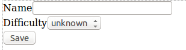

# Field types

Un formulario consiste en un conjunto de campos. Los _field types_ identifican los tipos de campo que tenemos a nuestra disposición. Además de los [field types proporcionados por Symfony](http://symfony.com/doc/current/reference/forms/types.html) podremos añadir nuestros propios tipos. En Symfony, además, un formulario puede ser definido como field type, flexibilizando enormemente la construcción de formularios complejos.


# Field types en formularios

Como hemos visto en anteriores capítulos, para añadir campos a un formulario utilizamos el método `add()`.

```php
class AuthorType extends AbstractType
{
    public function buildForm(FormBuilderInterface $builder, array $options)
    {
        $builder
        	->add('name', 'text')
            ->add('surname', 'text', array('required' => false, 'attr' => array('class' => 'surname')))
            //...;
    }
```

- El primer parámetro de `add` se refiere al atributo relacionado en la clase subyacente y es obligatorio.
- El segundo parámetro indica el field type. `text` es un field type básico que se transformará en un `<input type="text" />` durante el renderizado. Este atributo es opcional, y en su defecto, el componente de formularios tratará de _adivinar_ el tipo adecuado en función del valor del atributo.
- El tercer parámetro es un array opcional que permite especificar propiedades del campo. Las más comunes, `label` y `required`, son aplicables a todos los form types. `attr` permite especificar atributos que se aplicarán posteriormente a la etiqueta HTML. Cada field type puede tener otras propiedades configurables.


## Crear field types propios

Vamos a crear un formulario para crear recetas. De momento el formulario va a ser muy sencillo y solo va a permitir proporcionar el nombre y la dificultad de la receta. Hemos creado un modelo `Difficulties` para tener el código más organizado:

```php
namespace My\RecipesBundle\Model;

class Difficulties
{
    const UNKNOWN = 'unknown';
    const EASY = 'easy';
    const NORMAL = 'normal';
    const HARD = 'hard';

    public static function toArray()
    {
    	return array(
    		self::UNKNOWN => self::UNKNOWN,
    		self::EASY => self::EASY,
    		self::NORMAL => self::NORMAL,
    		self::HARD => self::HARD,
    		);
    }
}
```

Escribimos el formulario utilizando el field type `choice` proporcionado por Symfony.

```php
// src/My/RecipesBundle/Form/Type/RecipeType.php

class RecipeType extends AbstractType
{
    public function buildForm(FormBuilderInterface $builder, array $options)
    {
        $builder
            ->add('name', 'text')
            ->add('difficulty', 'choice', array('choices' => Difficulties::toArray()))
            ->add('save', 'submit');
    }
    // ...
}
```



Para aumentar la reusabilidad del código vamos a crear un form type propio para la dificultad.

```php
// src/My/RecipesBundle/Form/Type/DifficultyType.php
namespace My\RecipesBundle\Form\Type;

use Symfony\Component\Form\AbstractType;
use Symfony\Component\OptionsResolver\OptionsResolverInterface;
use My\RecipesBundle\Model\Difficulties;

class DifficultyType extends AbstractType
{
    public function setDefaultOptions(OptionsResolverInterface $resolver)
    {
        $resolver->setDefaults(array(
            'choices' => Difficulties::toArray()
        ));
    }

    public function getParent()
    {
        return 'choice';
    }

    public function getName()
    {
        return 'difficulty';
    }
}
```

Y lo usaremos en el formulario de recetas.

```php
// src/My/RecipesBundle/Form/Type/RecipeType.php

class RecipeType extends AbstractType
{
    public function buildForm(FormBuilderInterface $builder, array $options)
    {
        $builder
            ->add('name', 'text')
            ->add('difficulty', new DifficultyType)
            ->add('save', 'submit');
    }
}
```


## Ofrecer field types como servicios
El siguiente paso para ofrecer código extensible, reusable y mantenible es exponer nuestro `RecipeType` en la capa de servicios.

```php
# src/My/RecipesBundle/Resources/config/services.yml
services:
    my_recipes.form.type.difficulty:
        class: My\RecipesBundle\Form\Type\DifficultyType
        tags:
            - { name: form.type, alias: difficulty }
```

Y ahora cualquier formulario puede utilizar el desplegable como cualquier otro field type:

```php
        $builder
            ->add('difficulty', 'difficulty');
```


== EMBED FORMS ==
- Embed form
	- form collections

== THEMING ==
- Form theming


== FORM EVENTS ==


== DATA TRANSFORMERS ==

== Consultas a entidades => a repo ==
