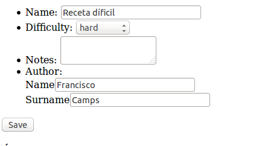

# Form Events

Los eventos de formulario son una manera de manipular formularios existentes de acuerdo a ciertas reglas de negocio. El ejemplo más común es el de mostrar formularios diferentes en función del estado del objeto subyacente.

Imaginemos, por ejemplo, que queremos añadir un textarea en el formulario de recetas, pero solo en las recetas difíciles.

En primer lugar vamos a crear una vista de edición de recetas:

```yaml
# src/My/RecipesBundle/Resources/config/routing.yml

#...
my_recipes_recipe_edit:
    pattern:  /recipes/{id}/edit
    defaults: { _controller: MyRecipesBundle:Recipe:edit }
```


```php
// src/My/RecipesBundle/Controller/RecipeController.php

class RecipeController extends Controller
{

    /**
     * @Template()
     */
    public function editAction(Recipe $recipe, Request $request)
    {
        $form = $this->createForm(new RecipeType, $recipe);
        $form->handleRequest($request);

        if ($form->isValid()) {
            $this->getDoctrine()->getManager()->flush();
            return $this->redirect($this->generateUrl('my_recipes_recipe_show', array('id' => $recipe->getId())));
        }
        return array(
            'form' => $form->createView(),
            'recipe' => $recipe);
    }
}
```

```html
{# src/My/RecipesBundle/Resources/views/Recipe/edit.html.twig #}



Edit {{ recipe.name }}


    {{ form(form) }}


```


## Crear y añadir un event subscriber

Para realizar el cambio en tiempo de ejecución vamos a añadir un _Event Subscriber_. Trataremos con detalle los distintos tipos de evento más adelante.

```php
// src/My/RecipesBundle/Form/EventListener/AddNotesFieldSubscriber.php
namespace My\RecipesBundle\Form\EventListener;

use Symfony\Component\Form\FormEvent;
use Symfony\Component\Form\FormEvents;
use Symfony\Component\EventDispatcher\EventSubscriberInterface;

class AddNotesFieldSubscriber implements EventSubscriberInterface
{
    public static function getSubscribedEvents()
    {
        return array(FormEvents::PRE_SET_DATA => 'preSetData');
    }

    public function preSetData(FormEvent $event)
    {
        $recipe = $event->getData();
        $form = $event->getForm();

        if ($recipe && $recipe->isHard()) {
            $form->add('notes', 'textarea', array('required' => false));
        }
    }
}
```

Utilizaremos el _Event Subscriber_ en el formulario mediante el método `addEventSubscriber()`.

```php
// src/My/RecipesBundle/Form/Type/RecipeType.php

use My\RecipesBundle\Form\EventListener\AddNotesFieldSubscriber;

class RecipeType extends AbstractType
{

    public function buildForm(FormBuilderInterface $builder, array $options)
    {
        $builder
            // ...
            ->add('save', 'submit');
        $builder->addEventSubscriber(new AddNotesFieldSubscriber());
    }
}
```

En la clase `Recipe` añadiremos el campo `notes` y actualizaremos la base de datos. Una vez realizados los cambios pertinentes podremos comprobar cómo se añade un textarea de manera condicional.




